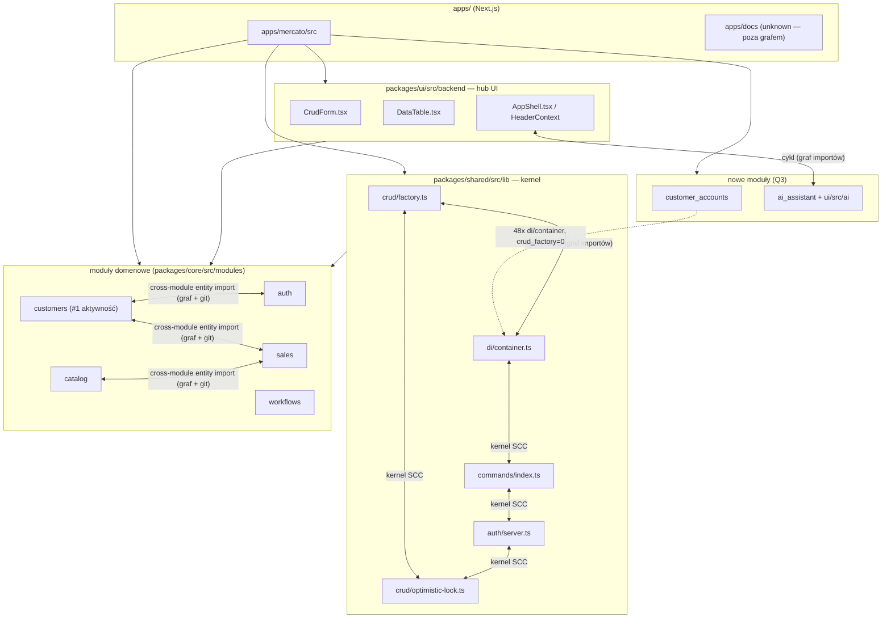

# Repo Map — Open Mercato (onboarding)

> Synteza trzech artefaktów: [`artifact-1-territory.md`](./artifact-1-territory.md) (12 mies. historii git), [`artifact-2-structure.md`](./artifact-2-structure.md) (graf importów `dependency-cruiser`), [`artifact-3-contributors.md`](./artifact-3-contributors.md) (kto pracował gdzie). Nie powtarza ich tabel — odsyła do nich po szczegóły.

## 1. TL;DR

Open Mercato to modularny monorepo (Next.js app `apps/mercato` + pakiety `@open-mercato/*`) — platforma typu e-commerce/CRM/ERP zbudowana wokół jednego "silnika" CRUD (`makeCrudRoute` + kontener DI) i wspólnej warstwy UI (`CrudForm`/`DataTable`/`AppShell`). Realna praca koncentruje się w modułach domenowych (`customers`, `sales`, `catalog`, `auth`, `workflows`, `customer_accounts`, `ai_assistant`) osadzonych na `packages/shared` (kernel: CRUD/DI/auth/commands) i `packages/ui/src/backend` (hub UI). W ostatnich 12 mies. `customers` był najcięższym modułem (3177 zmian, pełni rolę wzorca CRUD), a `ui/backend` jest najsilniej "spinającym" hubem (419 commitów ze sprzężeniami). Boli w trzech miejscach: (a) cykliczny "kernel SCC" w `shared/lib`, od którego zależy każdy route CRUD, ale granica jest egzekwowana tylko jako `warn`; (b) bezpośrednie importy encji ORM między `catalog`/`sales`/`customers`/`auth` mimo zakazu w AGENTS.md; (c) dwa nowe moduły z Q3 (`customer_accounts`, `ai_assistant`), które rosną szybko i częściowo omijają wzorzec CRUD-factory.

## 2. Teren — gdzie żyje system

**Moduły "głębokie"** (wysoka aktywność, centralne dla architektury — dane z artefaktu 1 §1):
- `customers` (3177), `ui/backend` (1737), `sales` (1688), `catalog` (1194), `auth` (1163), `shared/lib` (1038) — to TOP-6 i jednocześnie szkielet aplikacji.

**Moduły "płytsze", ale głośne**:
- `create-app` (979) — synchronizacja template'u dla zewnętrznych aplikacji, osobne ryzyko "template-sync".
- `workflows` (783) — silnik wykonawczy, mocny w Q2.
- `customer_accounts` (601) i `ai_assistant` (530) — **nowe moduły z Q3**, rosną szybko, wzorce jeszcze się krystalizują.

**Aktywność w czasie** (artefakt 1 §3):
- Q1 (2025-09 → 2025-12): fundament — `customers` jako wzorzec CRUD (15% zmian), równoległy rozwój `sales`/`catalog`/`auth`, fundamenty `CrudForm`/`DataTable`, `query_index`, `entities`.
- Q2 (2025-12 → 2026-03): dojrzewanie procesu — `customers` chwilowo spada do 4,5%, eksplozja `apps/docs` i `.ai/specs`/`.ai/qa` (proces spec-first), nowy `workflows`, intensywny `create-app`.
- Q3 (2026-03 → dziś): `customers` wraca na szczyt (13,4%, prawdopodobnie optimistic locking + polymorphic entities), nowe `customer_accounts` (portal klienta) i `ai_assistant`.

**Uwaga o strukturze vs aktywności**: `apps/docs` (~928 zmian) i `.ai/specs` (~816 zmian) to jedne z najaktywniejszych obszarów repo w ujęciu czystej liczby zmian plików — ale **nie istnieją w grafie zależności** (dependency-cruiser objął tylko `packages` + `apps/mercato/src`). Strukturalnie "peryferyjne" katalogi (dokumentacja/specyfikacje) są więc realnie jednym z głównych miejsc pracy zespołu — to dobry sygnał, że duża część "kosztu zmiany" w tym repo to dokumentowanie decyzji, nie tylko kod.

## 3. Realne powiązania — co naprawdę zmienia się razem

Trzy różne źródła dowodów, każde inaczej waży:

### a) Potwierdzone i w historii git, i w grafie importów (najsilniejszy sygnał)
- **`core-no-cross-module-entity-imports`**: `catalog↔sales`, `sales↔customers`, `customers↔auth` — bezpośrednie importy encji ORM (graf, `warn`), 1:1 pokrywające się z najwyższymi parami co-change z git history: `catalog↔sales`=121, `customers↔sales`=121, `auth↔customers`=100 (artefakt 1 §4 + artefakt 2 §1). To **realna**, ręczna, kosztowna sprzężenie — zmiana modelu danych w jednym module może po cichu złamać typy w drugim.
- **Kernel SCC** `crud/factory.ts ↔ di/container.ts ↔ commands/index.ts ↔ auth/server.ts ↔ crud/optimistic-lock.ts` — cykl w grafie importów (`no-circular`, `warn`), 47 importerów; `crud/factory.ts` jest też #6 plikiem wg liczby zmian (78). Każda zmiana tutaj ma promień rażenia na cały CRUD.

### b) Potwierdzone tylko w grafie importów (nowe sprzężenie, jeszcze nie "ciężkie" w historii)
- **`ui/backend ↔ ai_assistant`**: `AppShell.tsx`/`HeaderContext` ↔ `conversation-store.ts`/`useAiChat` — cykl wykryty przez `dependency-cruiser`, ale `ai_assistant` ma dopiero 530 zmian (nowy moduł Q3). To sprzężenie dopiero zacznie generować częste co-change.
- **`customers`**: `PersonCard ↔ CompanyPeopleSection` — cykl komponentów wewnątrz `customers/backend/customers/{people,companies}`.
- **`workflows`**: `step-handler ↔ parallel-handler ↔ transition-handler ↔ workflow-executor` — silnik stanowy, cykl handlerów dzielących `EntityManager`/`AwilixContainer`/`EventBus`.

### c) "Switchboard" — sprzężenie przez regenerację, NIE ręczną edycję (tańsze)
Pliki-rejestry z artefaktu 1 §5: `packages/shared/src/modules/registry.ts`, `apps/mercato/src/modules.ts`, `packages/cli/src/lib/generators/module-registry.ts`, `apps/docs/sidebars.ts`, `apps/mercato/src/i18n/{en,pl,es,de}.json`, `packages/core/src/modules/auth/api/admin/nav.ts` — każdy dotknięty przez 200+ różnych modułów, ale w dużej mierze **przez `yarn generate`**, nie przez ręczną logikę cross-modułową. Jeśli widzisz te pliki w diffie obok zmiany w jednym module — to zwykle automatyczna rejestracja, a nie architektoniczne sprzężenie. Waż to inaczej niż (a) i (b) przy ocenie kosztu PR-a.

### d) `unknown` — obszary BEZ grafu zależności (nie "brak powiązań", tylko "narzędzie tam nie sięga")
- `apps/docs`, `.ai/specs` — poza zakresem `dependency-cruiser` (`packages apps/mercato/src`), mimo wysokiej aktywności.
- `external/official-modules` (submoduł git, opcjonalny, niecommitowany w tym repo) — osobna historia git, brak w grafie.
- Tłumaczenia `i18n/*.json` — pliki nie-TS, nie śledzone przez graf importów, mimo że `apps/mercato/src/i18n/{en,pl,es,de}.json` to jeden z plików-rejestrów (56 commitów każdy).
- Importy z `@mikro-orm`/`EntityManager` z `node_modules` (`doNotFollow`) — `auth/server.ts` i silnik `workflows` korzystają z nich bezpośrednio; sprzężenie na poziomie schematu DB/encji **nie jest widoczne w grafie**.
- Konsumpcja `AppShell`/`conversation-store` z poziomu layoutów `apps/mercato/src/app/**` — wg artefaktu 2 §5 moduły domenowe mają tu 0 bezpośrednich importów, ale ścieżka konsumpcji na poziomie app-layout nie była objęta podgrafem `crud-factory-focus` — status: niezweryfikowany.

## 4. Strefy ryzyka

| # | Obszar | Dlaczego boli |
|---|---|---|
| 1 | **Kernel SCC** (`shared/lib/{crud,di,auth,commands}`) | Cykl importów obsługujący *każdy* `makeCrudRoute` (47 importerów); granica `no-circular` to tylko `warn` — nic nie blokuje pogłębiania cyklu. |
| 2 | **Cross-module entity imports** (`catalog↔sales↔customers↔auth`) | Bezpośrednie importy encji ORM łamią zasadę "no direct ORM relationships between modules" z AGENTS.md; pokrywa się z najwyższymi parami co-change — zmiana modelu w jednym module cicho rusza pozostałe. |
| 3 | **`ui/backend ↔ ai_assistant`** (AppShell/HeaderContext ↔ conversation-store) | Powłoka adminowa (hub #2 aktywności) sprzężona zwrotnie z nowym, szybko rosnącym modułem AI — żadna zmiana w jednym nie jest izolowana od drugiego. |
| 4 | **`customer_accounts/api/admin/*`** (hand-rolled routes) | Nowy moduł (Q3, 601 zmian), 48 importów `di/container` (najwyższy wynik w repo), `crud_factory=0` — możliwa duplikacja logiki resolve/auth zamiast wzorca referencyjnego. |
| 5 | **Silnik `workflows`** (step/parallel/transition handlers ↔ executor) | Stanowy, transakcyjny cykl handlerów — trudny do podziału na niezależne, testowalne jednostki. |
| 6 | **`customers`: PersonCard ↔ CompanyPeopleSection** | Cykl komponentów w najcięższym module repo (3177 zmian) — zmiana renderu jednej karty wymusza re-test drugiej. |

## 5. Kogo zapytać

(źródło: [`artifact-3-contributors.md`](./artifact-3-contributors.md) — Piotr Karwatka/pkarw jest dominujący wszędzie i pominięty tu celowo)

| Strefa ryzyka | Kandydaci |
|---|---|
| 1. Kernel SCC | **Patryk Lewczuk** (security/extensibility kernela, mutation lifecycle hooks) i **Lukasz Stasko** (migracje persist/flush w tym obszarze) |
| 2. Cross-module entity imports | **Patryk Lewczuk** + **Bernard van der Esch** (security/RBAC/tenant-scoping na styku modułów) i **Maciej Dudziak** (feature-development sales/customers, integration tests) |
| 3. ui/backend ↔ ai_assistant | **Patryk Lewczuk** (ai_assistant security/Code Mode, perf CrudForm) i **zielivia** (DS/AppShell, topbar/sidebar architektura) |
| 4. customer_accounts | **Patryk Lewczuk** (właściciel modułu, SPEC-060) i **WH173-P0NY**/**MarekUrzon** (security sesji portalu) |
| 5. Silnik workflows | **Patryk Lewczuk** (autor silnika) i **Bernard van der Esch** (rozszerzenia modelu wykonania: PARALLEL_FORK/JOIN, compensation) |
| 6. customers PersonCard/CompanyPeopleSection | **Maciej Dudziak** (główny kontrybutor `customers`, CRM UI) |

## 6. Pierwszy dzień — od czego zacząć czytanie

Kolejność: od reguł gry → przez kernel → przez wzorzec referencyjny → do hubów UI i miejsc integracji.

1. **`AGENTS.md`** (root) — reguły projektu, Task Router, granice architektoniczne (sekcja "NO direct ORM relationships between modules" tłumaczy strefę ryzyka #2).
2. **`packages/shared/src/lib/crud/factory.ts`** — `makeCrudRoute`, serce kernela; #6 plik wg liczby zmian (78), środek kernel SCC.
3. **`packages/shared/src/lib/di/container.ts`** — kontener DI, drugi węzeł kernel SCC; tu widać, jak `auth/server`/`commands`/`optimistic-lock` się zazębiają.
4. **`packages/core/src/modules/customers/AGENTS.md`** + jeden route API/strona — `customers` jest *referencyjnym* modułem CRUD (wzorzec dla nowych modułów) i jednocześnie najcięższym modułem repo.
5. **`packages/ui/src/backend/CrudForm.tsx`** — #1 plik wg liczby zmian (158), 44 zależności, hub UI wykorzystywany przez każdy formularz CRUD.
6. **`packages/ui/src/backend/AppShell.tsx`** — definiuje `HeaderContext`; punkt cyklu z `ai_assistant` (strefa ryzyka #3).
7. **`packages/core/src/modules/sales/commands/documents.ts`** — #9 plik wg zmian (68), 36 zależności obejmujących `catalog`+`customers`+`dictionaries`+`entities`; dobry przykład wzorca command + integracji cross-modułowej.
8. **`packages/cli/src/lib/testing/{integration,runtime-utils,integration-discovery}.ts`** — harness testowy DI/EntityManager; punkt wyjścia do testów integracyjnych dla `customers`/`sales`/nowych modułów (`customer_accounts`, `ai_assistant`).

## 7. Ograniczenia tej mapy

- **Okno czasowe**: 12 miesięcy wstecz od 2026-06-10/11. Faktyczna historia repo zaczyna się 2025-09-10, więc okno = praktycznie cała historia projektu — ale przyszłe odświeżenia tej mapy będą widzieć "ucinanie" wcześniejszych okresów.
- **Metoda aktywności (artefakt 1)**: agregacja zmian plików do "modułów" wg konwencji ścieżek, z odfiltrowanym szumem (lockfile'y, `*.snapshot*.json`, `*.generated.*`, configi, tłumaczenia per-moduł, zrzuty ekranu). Liczba zmian pliku ≠ złożoność ani ważność — duży plik konfiguracyjny edytowany rutynowo może mieć wysoką liczbę zmian bez realnego ryzyka.
- **Metoda grafu (artefakt 2)**: `dependency-cruiser` objął wyłącznie `packages` + `apps/mercato/src`; reguły `no-circular` i `core-no-cross-module-entity-imports` to `warn`, nie `error` — istnienie cyklu w grafie nie znaczy, że CI go blokuje. `doNotFollow` na `node_modules` ukrywa sprzężenia przez `@mikro-orm`/encje DB.
- **Czego mapa NIE pokazuje**: `apps/docs`, `.ai/specs`, `external/official-modules` (submoduł), pliki i18n, sprzężenia na poziomie schematu bazy danych/migracji, oraz konsumpcję `AppShell`/`conversation-store` z poziomu `apps/mercato/src/app/**` (poza zasięgiem podgrafu `crud-factory-focus`).
- **Kontrybutorzy (artefakt 3)**: tylko ostatnie 12 mies., tylko 5 wybranych stref, deduplikacja tożsamości autorów jest najlepszym możliwym przybliżeniem (część osób commituje pod wieloma nazwami/e-mailami) — traktuj jako punkt startowy do rozmowy, nie ostateczną listę "właścicieli".
- To **migawka** (wygenerowana 2026-06-10/11) — repo żyje, warto odświeżyć po dużych refaktorach (np. rozplątaniu kernel SCC albo eliminacji cross-module entity imports).
